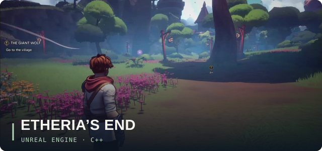
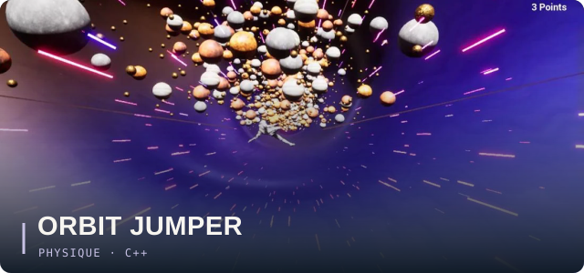
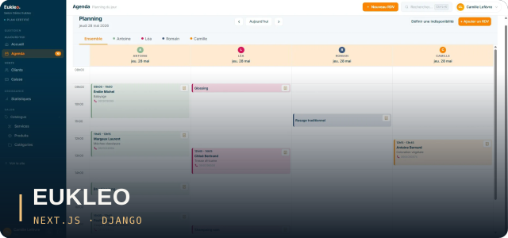

<!--
/**
 * ArsStolas Project, 2026
 * Created by: "ArsStolas"
 * Last Updated by: "ArsStolas"
 * Class: "ReadMe" - Github Profile ReadMe
 */
-->

<a href="./assets/hero-dark.svg#gh-dark-mode-only">
  <picture>
    <source media="(max-width: 640px)" srcset="./assets/hero-mobile-dark.svg">
    
  </picture>
</a>
<a href="./assets/hero-light.svg#gh-light-mode-only">
  <picture>
    <source media="(max-width: 640px)" srcset="./assets/hero-mobile-light.svg">
    
  </picture>
</a>

  
  &nbsp;
  

<h2>Salut, moi c’est Léo.</h2>

Je suis développeur, avec une préférence assez nette pour le <strong>jeu vidéo</strong>. Je travaille surtout sur Unreal Engine, en C++ et en Blueprints, mais aussi sur Unity. J’aime particulièrement programmer les IA, jouer avec la physique et faire fonctionner tout ça en multijoueur.

Je suis actuellement en <strong>Master 2 Gtech chez Quest Education Group</strong>. Avant ça, j’ai validé mon <strong>Master 1 chez Epitech</strong>, où j’ai fait du développement, mais aussi du design, de la communication, du marketing et de la gestion de projet.

À côté des jeux, je développe des sites et des applications web et mobiles. Je suis aussi <strong>directeur général associé de <a href="https://born-to-web.com/">Born To Web</a></strong>. J’y partage mon temps entre le développement, le design, le suivi des projets, la communication, les partenariats et la publicité.

 

<h2>Quelques projets à découvrir</h2>

<h3>Etheria’s End</h3>

Une aventure au grappin entre des îles flottantes. Co-lead du projet, j’ai développé les IA et les systèmes C++.

<a href="https://github.com/ArsStolas/Etheria-UE5.6.1">Voir le code ↗</a>

 

<h3>Orbit Jumper</h3>

Un ragdoll à catapulter entre des planètes. J’ai développé la physique, la génération procédurale et les fonctionnalités en ligne.

 

<h3>Eukleo</h3>

Un outil pour les professionnels de la beauté, co-développé chez Born To Web. J’ai travaillé sur le front Next.js et le back Django.

<a href="https://eukleo.com/">Découvrir Eukleo ↗</a>

 

<h2>Et quelques autres</h2>
<ul>
<li><strong>Gobelins, Grimoires et gros Bobos</strong> : combat magique, multijoueur et interfaces.</li>
<li><strong>Chivalry Is Dead</strong> : réseau, IA et chat vocal pour des chevaliers en coop.</li>
<li><a href="https://github.com/ArsStolas/HD2D_AttractionPark"><strong>Attraction Park</strong></a> : un prototype de parc réalisé seul en trois jours.</li>
<li><strong>Frog’s</strong> : ressources et métier de mineur dans un village de grenouilles.</li>
<li><strong>Draw Of The Day</strong> : une application de dessin solo et duo que j’ai développée en full stack.</li>
<li><strong>Drop That Sh!t</strong> : notre prochain jeu en équipe, encore en préproduction.</li>
<li><strong>Sapify</strong> : une application autour des plantes, co-développée avec Alexandre Quintela et arrêtée en 2023.</li>
</ul>
 

<h2>Ce que j’utilise</h2>

<strong>Jeu vidéo</strong> <code>Unreal Engine</code> <code>C++</code> <code>Blueprints</code> <code>Unity</code> <code>C#</code> Gameplay, comportements d’IA, physique, multijoueur et interfaces.

<strong>Web & mobile</strong> <code>JavaScript</code> <code>Next.js</code> <code>Node.js</code> <code>Django</code> <code>Python</code> <code>React Native</code> <code>Firebase</code> Pour mes projets web et mobiles, selon les besoins.

<strong>Autour du code</strong> Je fais aussi du game design, du design d’interfaces et de la gestion de projet. Mon parcours et mon travail chez Born To Web m’amènent également à m’occuper de communication et de marketing.

 

<h2>On en parle ?</h2>

J’aimerais faire du jeu vidéo mon métier à plein temps. Si tu veux discuter d’un projet, de développement ou simplement faire connaissance, <a href="https://www.linkedin.com/in/leo-queiros"><strong>retrouve-moi sur LinkedIn ↗</strong></a>.

<a href="./assets/footer-dark.svg#gh-dark-mode-only">
  <picture>
    <source media="(max-width: 640px)" srcset="./assets/footer-mobile-dark.svg">
    
  </picture>
</a>
<a href="./assets/footer-light.svg#gh-light-mode-only">
  <picture>
    <source media="(max-width: 640px)" srcset="./assets/footer-mobile-light.svg">
    
  </picture>
</a>
