<!--
/**
 * ArsStolas Project, 2026
 * Created by: "ArsStolas"
 * Last Updated by: "ArsStolas"
 * Class: "ReadMe" - Github Profile ReadMe
 */
-->

<a href="./assets/hero-dark.svg#gh-dark-mode-only">
  <picture>
    <source media="(max-width: 640px)" srcset="./assets/hero-mobile-dark.svg">
    
  </picture>
</a>
<a href="./assets/hero-light.svg#gh-light-mode-only">
  <picture>
    <source media="(max-width: 640px)" srcset="./assets/hero-mobile-light.svg">
    
  </picture>
</a>

  
  &nbsp;
  

<h2>Salut, moi c’est Léo.</h2>

Je suis développeur, avec une préférence assez nette pour le <strong>jeu vidéo</strong>. Je travaille surtout sur Unreal Engine, en C++ et en Blueprints, mais aussi sur Unity. J’aime particulièrement programmer les IA, jouer avec la physique et faire fonctionner tout ça en multijoueur.

Je suis actuellement en <strong>Master 2 Gtech chez Quest Education Group</strong>. Avant ça, j’ai validé mon <strong>Master 1 chez Epitech</strong>, où j’ai fait du développement, mais aussi du design, de la communication, du marketing et de la gestion de projet.

À côté des jeux, je développe des sites et des applications web et mobiles. Je suis aussi <strong>directeur général associé de <a href="https://born-to-web.com/">Born To Web</a></strong>. J’y partage mon temps entre le développement, le design, le suivi des projets, la communication, les partenariats et la publicité.

 

<a href="./assets/games-dark.svg#gh-dark-mode-only">
  <picture>
    <source media="(max-width: 640px)" srcset="./assets/games-mobile-dark.svg">
    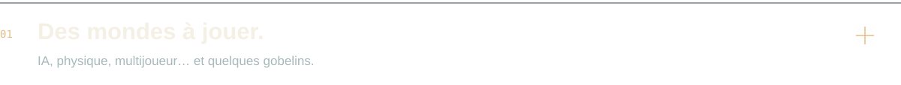
  </picture>
</a>
<a href="./assets/games-light.svg#gh-light-mode-only">
  <picture>
    <source media="(max-width: 640px)" srcset="./assets/games-mobile-light.svg">
    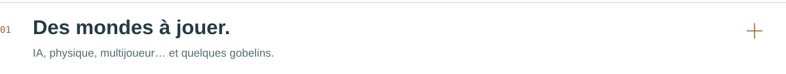
  </picture>
</a>

<table>
  <tr>
    <td width="50%" valign="top">
      
      <h3>Etheria’s End</h3>
      
Une aventure au grappin. Co-lead, j’ai développé les IA et les systèmes C++.

      
<code>Unreal Engine</code> <code>C++</code> <code>Blueprints</code>

      
<a href="https://github.com/ArsStolas/Etheria-UE5.6.1">Voir le code ↗</a>

    </td>
    <td width="50%" valign="top">
      
      <h3>Orbit Jumper</h3>
      
Un ragdoll entre des planètes. J’ai développé la physique et la génération procédurale.

      
<code>Unreal Engine</code> <code>C++</code> <code>Firebase</code>

    </td>
  </tr>
  <tr>
    <td width="50%" valign="top">
      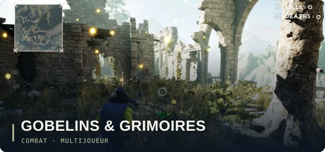
      <h3>Gobelins, Grimoires et gros Bobos</h3>
      
Des gobelins et des sorts. J’ai développé le combat, le multijoueur et les interfaces.

      
<code>Unreal Engine</code> <code>C++</code> <code>Réplication</code>

    </td>
    <td width="50%" valign="top">
      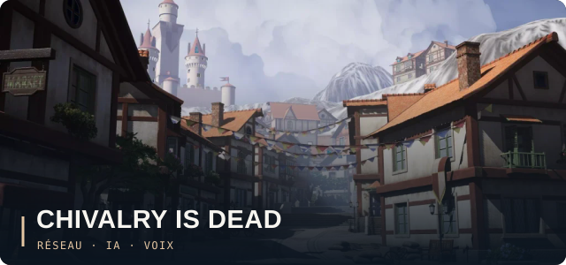
      <h3>Chivalry Is Dead</h3>
      
Des chevaliers en coop. Je me suis occupé du réseau, des IA et du chat vocal.

      
<code>Unreal Engine</code> <code>Blueprints</code> <code>IA</code>

    </td>
  </tr>
  <tr>
    <td width="50%" valign="top">
      <a href="https://github.com/ArsStolas/HD2D_AttractionPark">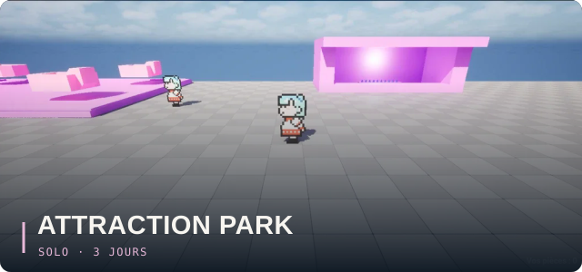</a>
      <h3>Attraction Park</h3>
      
Un parc à explorer, réalisé seul en trois jours. J’ai développé tout le prototype.

      
<code>Unreal Engine</code> <code>Blueprints</code> <code>Materials</code>

      
<a href="https://github.com/ArsStolas/HD2D_AttractionPark">Voir le code ↗</a>

    </td>
    <td width="50%" valign="top">
      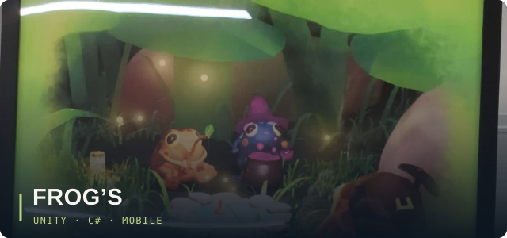
      <h3>Frog’s</h3>
      
Un village de grenouilles. J’ai développé les ressources et le métier de mineur.

      
<code>Unity</code> <code>C#</code> <code>Mobile</code>

    </td>
  </tr>
</table>

  
<strong>En préparation : Drop That Sh!t</strong> · préproduction

   
  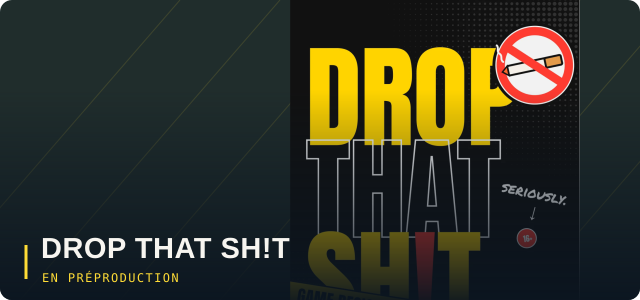
  
C’est notre prochain projet en équipe, une comédie d’action à la première personne. On en est encore à la conception. Je participe au game design et je travaillerai aussi sur le level design, le développement et une partie de la direction artistique.

  
<code>Game design</code> <code>Préproduction</code> <code>Unreal Engine 5.8 prévu</code>

  
Le visuel vient du GDD. Le prototype reste à construire.

 

<a href="./assets/apps-dark.svg#gh-dark-mode-only">
  <picture>
    <source media="(max-width: 640px)" srcset="./assets/apps-mobile-dark.svg">
    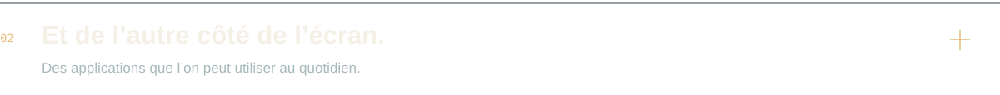
  </picture>
</a>
<a href="./assets/apps-light.svg#gh-light-mode-only">
  <picture>
    <source media="(max-width: 640px)" srcset="./assets/apps-mobile-light.svg">
    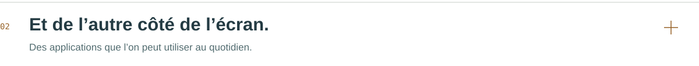
  </picture>
</a>

<table>
  <tr>
    <td width="50%" valign="top">
      
      <h3>Eukleo</h3>
      
Un outil pour les pros de la beauté, co-développé chez Born To Web en full stack.

      
<code>Next.js</code> <code>Django</code> <code>Python</code> <code>API REST</code>

      
<a href="https://eukleo.com/">Découvrir Eukleo ↗</a>

    </td>
    <td width="50%" valign="top">
      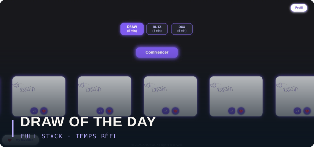
      <h3>Draw Of The Day</h3>
      
Du dessin solo ou en duo. J’ai porté le projet et développé toute l’application.

      
<code>JavaScript</code> <code>Node.js</code> <code>Firebase</code>

    </td>
  </tr>
</table>

  
<strong>Dans les archives : Sapify</strong> · mobile, 2022–2023

   
  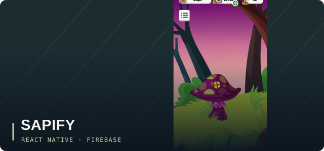
  
Avec Alexandre Quintela, on a travaillé sur une application mobile pour découvrir les plantes. J’ai participé au développement full stack et à l’organisation du projet. On l’a arrêté en 2023 ; les visuels présentés sont les maquettes que j’en ai gardées.

  
<code>React Native</code> <code>Firebase</code>

  
Projet arrêté en 2023. Le visuel présenté est une maquette.

 

<h2>Ce que j’utilise</h2>

<strong>Jeu vidéo</strong> <code>Unreal Engine</code> <code>C++</code> <code>Blueprints</code> <code>Unity</code> <code>C#</code> Gameplay, comportements d’IA, physique, multijoueur et interfaces.

<strong>Web & mobile</strong> <code>JavaScript</code> <code>Next.js</code> <code>Node.js</code> <code>Django</code> <code>Python</code> <code>React Native</code> <code>Firebase</code> Pour mes projets web et mobiles, selon les besoins.

<strong>Autour du code</strong> Je fais aussi du game design, du design d’interfaces et de la gestion de projet. Mon parcours et mon travail chez Born To Web m’amènent également à m’occuper de communication et de marketing.

 

<h2>On en parle ?</h2>

J’aimerais faire du jeu vidéo mon métier à plein temps. Si tu veux discuter d’un projet, de développement ou simplement faire connaissance, <a href="https://www.linkedin.com/in/leo-queiros"><strong>retrouve-moi sur LinkedIn ↗</strong></a>.

<a href="./assets/footer-dark.svg#gh-dark-mode-only">
  <picture>
    <source media="(max-width: 640px)" srcset="./assets/footer-mobile-dark.svg">
    
  </picture>
</a>
<a href="./assets/footer-light.svg#gh-light-mode-only">
  <picture>
    <source media="(max-width: 640px)" srcset="./assets/footer-mobile-light.svg">
    
  </picture>
</a>
